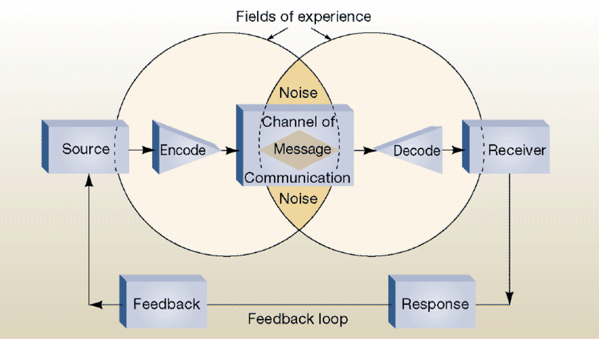
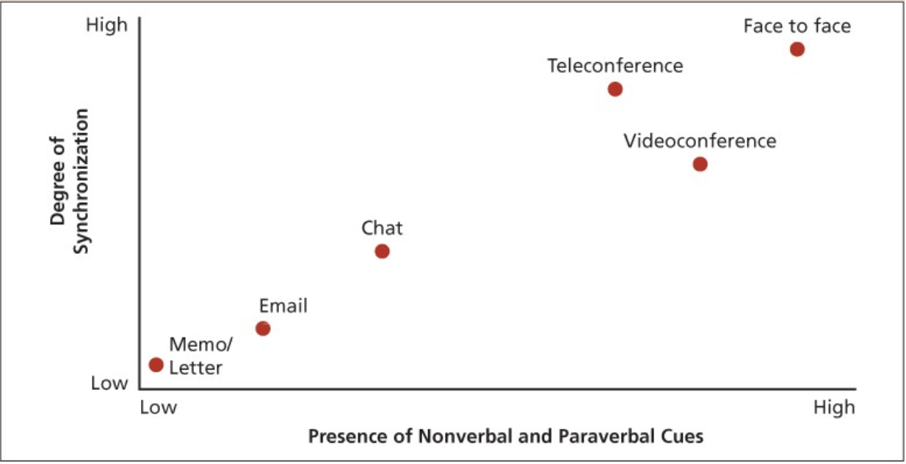

## Week 7 - Communication

### What is Communication
- process by which information is exchanged between a sender and a reciever
- **Interpersonal** communication happens between people 
- Simpliest interpersonal communication is between two people 👫

#### Model of Communication Process

- The model points out the complexities of the communication process and demonstrates the number of points where errors can occur.
- Effective communication occurs when:
    - the **right people** recieve
    - the **right information**
    - in a **timely manner**
- violating these three conditions results in ineffective communication

### Chain of commands
- lines of authority and formal reporting relationships in an organization
- three forms of communication:
    - Downward communication
    - Upward communication
    - Horizontal communication
- Often ineffective due to:
    - Informal communication: Grapevine
    - Filtering: Important information can be left out
    - Slowness

### Voice
- Voice is the **constructive expresson of disagreement** or concern about work unit or organizational practices
- involves "Speaking Up" and is contrasted with "Silence" which is witholding relevant information
- form of organizational citizenship behavior (OCB)

#### Psychological Safety
- Shared belief that social risk is safe to take
- a positive climate for voice can contribute to psychological safety
- self-censorship will create a climate of silence

### Jargon
- specialized language used by members of organizations to communicate with one another.
- Can be a efficient means to communicating within peers

BUT
- Can be a status symbol when mastered
- Jargon can also be a barrier between department's communications

### Non-verbal Language of work
- Body Language
- Probs, artifacts and costumes
- Beyond "words" said: **Paralanguage**

#### Body Language 
- Communicate by means of sender's bodily motion and facial expression or
- the physical location of the sender in relation to the reciever
##### Positive Body Language
- Position physically close
- Touch the reciever
- Maintain eye contact
- Lean forward
- Body is facing the reciever

#### Paralanguage

### Computer Mediated Language
- **Information Richness** refers to the potential information carrying of a communication medium
- Two key elements are:
    - degree that the information are synchronous
    - degree that both parties recieve non verbal and paralanguage

- Less **routine communication** requires **richer communication** media (more important decisions)

### Basic Principles of Effective Communication
- Take the time
- Be accepting
- Do not confuse the person with the problem
- Say what you feel
- Listen actively
- Give timely and specific feedback

#### Active Listening Techniques
- Watch the body language
- Paraphrase the speaker's meaning
- Show empathy
- Ask questions
- Wait out pauses

#### Organizational Approaches to Improve Communication
- Provision of Explanation
- 360o Feedback
- Employee Surveys and Feedbacks
- Suggestion Services
- Telephone Hotlines, Intranets, and Webcasts
- Management Training
    - Proper Training improve communication for managers

#### Cross Cultural Communication
- Language differences
- Non-verbal communication
- Etiquette and politeness
- Social Conventions
- Cultural Context

