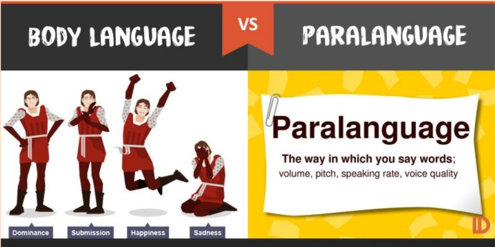
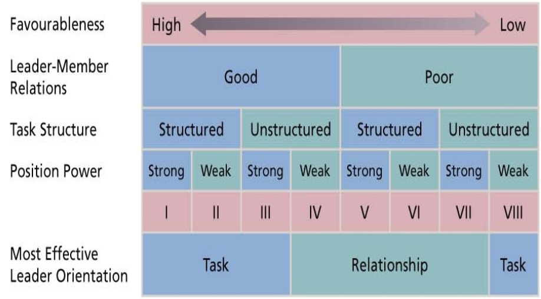
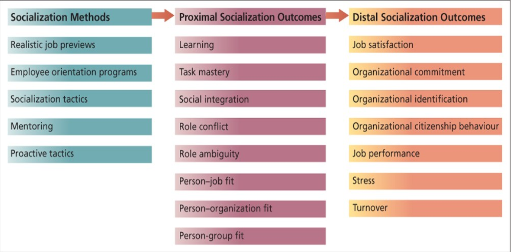
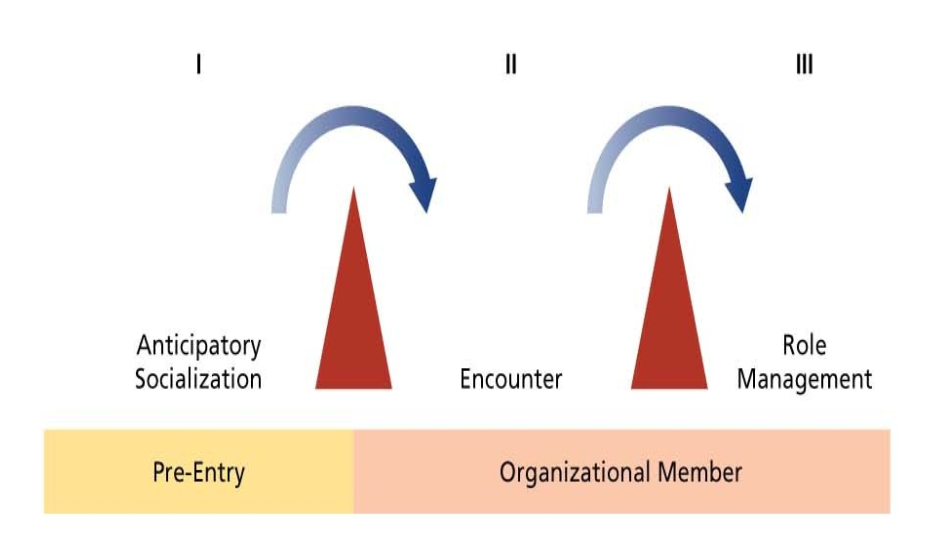
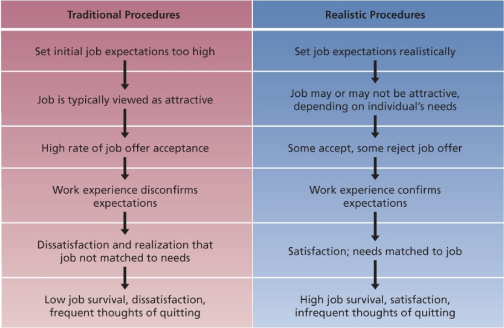
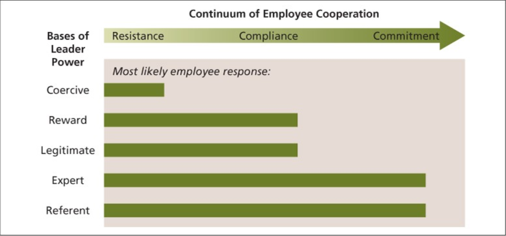

# 1BA3 Organizational Behavior

## Table of Contents
- [What is Communication
](#what-is-communication
)
- [Non-verbal Language of work
](#non-verbal-language-of-work
)
- [Computer Mediated Language
](#computer-mediated-language
)
- [What is Leadership
](#what-is-leadership
)
- [Trait Theory of Leadership
](#trait-theory-of-leadership
)
- [Ohio State Leadership Study
](#ohio-state-leadership-study
)
- [Situational Theories of Leadership
](#situational-theories-of-leadership
)
- [Leader-Member Exchange (LMX) Theory
](#leader-member-exchange-lmx-theory
)
- [Transactional vs. Transformational Leadership
](#transactional-vs-transformational-leadership
)
- [Social Influence and Socialization
](#social-influence-and-socialization
)
- [Psychological Contract
](#psychological-contract
)
- [Employee Orientation Programs
](#employee-orientation-programs
)
- [Socialization Tatics
](#socialization-tatics
)
- [Mentoring
](#mentoring
)
- [What is Power
](#what-is-power
)
- [Empowerment
](#empowerment
)
- [Influence Tatics
](#influence-tatics
)
- [Who wants power
](#who-wants-power
)
- [Organizational Politics
](#organizational-politics
)
- [Ethics in Organizations
](#ethics-in-organizations
)
- [Sexual Harassment
](#sexual-harassment
)
- [Ethical Guidelines
](#ethical-guidelines
)
)
- [Non-verbal Language of work
](#non-verbal-language-of-work
)
- [Computer Mediated Language
](#computer-mediated-language
)
- [What is Leadership
](#what-is-leadership
)
- [Trait Theory of Leadership
](#trait-theory-of-leadership
)
- [Ohio State Leadership Study
](#ohio-state-leadership-study
)
- [Situational Theories of Leadership
](#situational-theories-of-leadership
)
- [Leader-Member Exchange (LMX) Theory
](#leader-member-exchange-lmx-theory
)
- [Transactional vs. Transformational Leadership
](#transactional-vs-transformational-leadership
)
- [Social Influence and Socialization
](#social-influence-and-socialization
)
- [Psychological Contract
](#psychological-contract
)
- [Employee Orientation Programs
](#employee-orientation-programs
)
- [Socialization Tatics
](#socialization-tatics
)
- [Mentoring
](#mentoring
)
- [What is Power
](#what-is-power
)
- [Empowerment
](#empowerment
)
- [Influence Tatics
](#influence-tatics
)
- [Who wants power
](#who-wants-power
)
- [Organizational Politics
](#organizational-politics
)
)
- [Non-verbal Language of work
](#non-verbal-language-of-work
)
- [Computer Mediated Language
](#computer-mediated-language
)
- [Chain of commands
](#chain-of-commands
)
- [Voice
](#voice
)
- [Jargon
](#jargon
)
- [Non-verbal Language of work
](#non-verbal-language-of-work
)
- [Computer Mediated Language
](#computer-mediated-language
)
- [Basic Principles of Effective Communication
](#basic-principles-of-effective-communication
)

## Week 7 - Communication

### What is Communication
- process by which information is exchanged between a sender and a reciever
- **Interpersonal** communication happens between people 
- Simpliest interpersonal communication is between two people 👫

#### Model of Communication Process

- The model points out the complexities of the communication process and demonstrates the number of points where errors can occur.
- Effective communication occurs when:
    - the **right people** recieve
    - the **right information**
    - in a **timely manner**
- violating these three conditions results in ineffective communication

#### Chain of commands
- lines of authority and formal reporting relationships in an organization
- three forms of communication:
    - Downward communication
    - Upward communication
    - Horizontal communication
- Often ineffective due to:
    - Informal communication: Grapevine
    - Filtering: Important information can be left out
    - Slowness

#### Voice
- Voice is the **constructive expresson of disagreement** or concern about work unit or organizational practices
- involves "Speaking Up" and is contrasted with "Silence" which is witholding relevant information
- form of organizational citizenship behavior (OCB)

#### Psychological Safety
- Shared belief that social risk is safe to take
- a positive climate for voice can contribute to psychological safety
- self-censorship will create a climate of silence

#### Jargon
- specialized language used by members of organizations to communicate with one another.
- Can be a efficient means to communicating within peers

BUT
- Can be a status symbol when mastered
- Jargon can also be a barrier between department's communications

### Non-verbal Language of work
- Body Language
- Probs, artifacts and costumes
- Beyond "words" said: **Paralanguage**

#### Body Language 
- Communicate by means of sender's bodily motion and facial expression or
- the physical location of the sender in relation to the reciever
##### Positive Body Language
- Position physically close
- Touch the reciever
- Maintain eye contact
- Lean forward
- Body is facing the reciever

#### Paralanguage

### Computer Mediated Language
- **Information Richness** refers to the potential information carrying of a communication medium
- Two key elements are:
    - degree that the information are synchronous
    - degree that both parties recieve non verbal and paralanguage

- Less **routine communication** requires **richer communication** media (more important decisions)

#### Basic Principles of Effective Communication
- Take the time
- Be accepting
- Do not confuse the person with the problem
- Say what you feel
- Listen actively
- Give timely and specific feedback

#### Active Listening Techniques
- Watch the body language
- Paraphrase the speaker's meaning
- Show empathy
- Ask questions
- Wait out pauses

#### Organizational Approaches to Improve Communication
- Provision of Explanation
- 360o Feedback
- Employee Surveys and Feedbacks
- Suggestion Services
- Telephone Hotlines, Intranets, and Webcasts
- Management Training
    - Proper Training improve communication for managers

#### Cross Cultural Communication
- Language differences
- Non-verbal communication
- Etiquette and politeness
- Social Conventions
- Cultural Context

## Week 9 - Leadership

### What is Leadership
- All about influence
- Strong influence on an organization's stategy, success and survival

#### Formal vs. Informal Leader
- Formal Leadership
    - Those with titles such as *manager*, *executives*, *supervisor*
    - Expected to influence others, and given authority for employees
    
    BUT
    - Some people fail to influence anybody
    - Leadership goes beyond formal rule requirements

- Informal Leadership
    - Those that emerge from individuals 
    - no formal authority
    - relies on being well liked or being precieved as high skilled to influence others

### Trait Theory of Leadership
- Leadership depends on personal traits of individuals
- those who become great leaders have set of traits that makes them stand out among the mass

##### Limitations to Trait Theory
- not the best means of understanding and improving leadership
- Traits are not sufficients
- Traits are only a precondition for actions that must be taken
- **Behavior** have a greater impact on leadership effectiveness

### Ohio State Leadership Study
- most systematic study of leadership
- two behaviors (independent dimensions):
    - Consideration
    - Initiating Structure

#### Consideration
- approachability, and shows empathy and respect for employees
- Friendly and egalitarian

#### Initiating Structure
- Degree to which group goal attainment is concentrated
- clearly defines and organizes each person's roles and schedules the work to be done

#### Consequences
- Both contribute positively to employee's motivation, job satisfaction, and leader effectiveness
- Consideration is more related to follower satisfaction, motivation, and leader effectiveness
- Initiating stucture is slightly more strongly related to leader job and group performance

#### Leader Reward and Punishment
- Great Jackass Fallacy
    - Humans are more than just mules
    - If left alone, they will want to follow leadership.
    - Can create more opportunities if allowed to have more voice

- A leader's behavior to change their reward and punishment is positively related to employee's perceptions, attitudes and behavior

### Situational Theories of Leadership
- **Situation** - the setting
- effectiveness of a leadership style is dependent on the setting.
- two known theories of leadership is
    - Fiedler's Contingency Theory
    - House's Path-Goal Theory

#### Fiedler's Contingency Theory
- Association between **leadership orientation** and **effectiveness** is *contingent on* the extent to which the *situation is favourable* for exerting influence
- Leadership Orientation
    - how does a leader describe their Least Preferred Co-Worker (LPC)
        - favourably = relationship oriented
        - unfavourably = task oriented
    - Least Preferred Co-Worker is a current/past co-worker that the leader have difficulties with.

##### Situational Favourableness
- which LPC orientation should contribute most to group effectiveness
- Factors that affect situational favourableness:
    - Leader-member relations (most important)
    - Task structure
    - Position Power (least important)

#### Path-Goal Theory
- Concerned with which leadership behavior is the most effective under which situations
- A leader's most important activity is to clarify the path to various goals of interest to employees and organizations.

Leadership Behaviors
- Directive behavior
- Supportive behavior
- Participative behavior
- Achievement-oriented behavior

Situational Factors
- effectiveness of each set of behaviors is dependent on the situations that the leader encounters:
    - Employee characteristics
    - Work environment factors
- Leaders tailor behaviors to needs, abilities and personalities of individual employees
- Effective Leaders take advantage of the motivating and satisfying aspects of jobs while
- offsetting or compensating those job aspects that demotivate or dissatisfy

##### Participative Leadership
- much research shows that opportunity to participate in work-related decisions increaases job satisfaction, task performance and organizational citizenship behaviour
- partly due to employee empowerment and trust in supervisor
- most workers prefer participative work environment

### Leader-Member Exchange (LMX) Theory
- Effective leadership processes occur when leaders and employees develop and maintain high-quality social exchange relationships.
- basis of LMX is social exchange theory and norm of reciprocity
- LMX reflects degree of
    - mutual support
    - trust
    - loyalty
    - open communication
    - respect between leader and employee
- Employees with higher quality LMX have higher
    - self-efficacy
    - positive work attitudes
    - OCB and job performance
- Higher quality LMX results in positive outcomes for leaders, employees, work units and organizations

### Transactional vs. Transformational Leadership
- **Transactional leadership** - based on straighforward exchange between leader and followers
    - Transactional behaviors involve:
        - Contingent reward
        - Management by exception
- **Transformational leadership** - providing a vision that instills true commitment, changing beliefs and attitudes and motivating to achieve performance beyond expectations
    - usually also good at transactional leadership
    - key dimensions of transformational leader behaviors (4 I's) 
        - Intellectual stimulation
        - Individualized consideration
        - Inspirational motivation
        - Idealized Influence (Charisma)

Intellectual Simulation
- Ability to think about problems, issues, and stategies in new ways
- leader challenges assumptions, takes risks and solicits follower's ideas
- involves creativity and novelty

Individualized Consideration
- treating employees as distinct individuals
- serves as mentor or coach when appropriate
- emphasis on one-on-one to discuss concerns and needs of individuals

Inspirational Motivation
- Communication of visions that are appealing and inspiring to followers
- Strong vision for the future based on values and ideals
- stimulate enthusiasm, challenge followers with high standards, communicate optimism about future goal attainment and provide meaning for task at hand

Idealized Influence (Charisma)
- **most important aspect**
- Leader is a role model
- Inspires loyalty and devotion from followers
- Followers trust, identify with and internalize the values and goals of the leader
- emotional aspect of transformational leadership

#### Research Evidence
- strongly related to
    - follower motivation and satisfaction
    - leader performance and effectiveness and
    - individual, group and organization performance
- especially effective during times of change and obtaining employees' commitment to change
- Best leaders are both transformational and transactional

## Week 10 Chapter 8 

### Social Influence and Socialization

#### Social Influence in Organizations
- queues from others on how to think and feel and act
- people rely on others on what is expected in social setting
- Positive and negative feedback
    - information dependence
    - effect dependence

#### Social Information Processing Theory
- how information 

#### SOcial Influence Process 
- Compliance
    - Cause external reasons
- Identification
    - can identify with 
- Internalization
    - become one's thought and true feelings

#### Organization Socialization
- Strengthen and improve culture to new members
- Socialization is process that people will learn attitudes, knowledge and behaviors of organization

- Good for all involved if socialization is focused.
- 3 fits
    - Person-job
    - Person-organization
    - Person-group
- PJ and PO influences by socialization process
- Organizational identification
    - how much someone defines themselves in terms of organization

- 1: Before entry
    - Tours and Research
- 2: new member
    - Mentors
- 3: 

#### Unrealistic Expectations
- Media shows best parts
- Recruitors will hype up the job too much
- Ends up too good to be true
    - Reality shock

### Psychological Contract
- Beliefs by employees that their hard work will pay off
- Should not hold one, can easily violate.

#### How to Avoid
- Realistic job previews
- Employee orientation programs
- Socialization tatics
- Mentoring

#### Realistic job preview(RJPs)
- let job applicants know about the positives and negatives of the job. 
- corrective action towards the unrealistic expectations.
- Gives more power to the job applicants to their choices.
- No culture shock.

- saves money and have higher job satisfactions

### Employee Orientation Programs
- introduce new employees to jobs
- **Realistic Orientation Program for Entry Stress**(ROPES)

### Socialization Tatics
- s

### Mentoring
- More senior person in organization who provides guidance and special attention
- Gives more opportunities and assists 
- Career functions
    - Gives more opportunities in the career
    - Access to more networking and resources otherwise not available
- Psychosocial functions

#### Formal Mentoring Program
- often informal relationships
- Designed and sponsored by organiation where seasoned employees recruited mentors and matched with proteges
- Allows networking between people that dont often happen

#### Developmental Networks
- Groups of people that advances a proteges by providing developmental assistance
- Multiple developers from inside and outside organization

#### Women and Mentoring
- lack of mentors major barrier for advancement of women

### What is Power
- Capacity to Influence others
- relative to each level
- can be a unit or an individual

#### Bases of Individual Power
- Legitimate power
    - Positional Power
- Reward power
    - ability to give
        - Pay, Bonus
        - presence
- Coercive
    - threat of punishment
        - Firing
        - Shunning
- Referent power
    - Others respecting you so more peopl
- Expert Power
    - Respect from abilities

#### Employee Response

- Coercive is worst since negative view on you
- Reward and Legitimate gets compliance
- Best Response is Expert and Referent

#### How do people gain power
- Do the right thing at the right time
- Create the Right relationships with people
    - Extraordinary
    - Visible
    - Relevant

#### Cultivating Relationships
- Outsiders
- Subordinates
- Peers
- Superiors

### Empowerment
- Giving people the authority, opportunity and motivation to take initiative and solve organizational power

### Influence Tatics
- Assertiveness
- Ingratiation
- Rationality
- Exchange
- Upward appeal
- Coalition formation
- Inspirational Appeal
- Consultation
- Collaboration

### Who wants power
- Need for power = n Pow
- **Institutional Manager**
    - high n Pow
    - use power to reach organizational goals
    - participative style
    - unconcerned with how much others likehim
- **Personal Power**
    - use for personal gaim
- **Affiliative Manager**
    - concerned with being liked

#### Subunit Power
- How does subordinates have power
    - Scarcity
    - Uncertainty
    - Certainty
    - Substitutability

### Organizational Politics
- Pursuit of self-interest in an organization
- Needed Evil in organization
- Try to build an environment that creates a positive politics
    - Do not spread rumors
    - Build own power with positive manner

#### Facets of Political Skill
- To understand people and using that knowledge to influence others
    - Social Astuteness
    - Interpersonal Influence
    - Apparent Sincerity
    - Networking Ability

Networking
- most important aspect of power aquisition

#### Machiavellianism
- Acts on own self-interest
- cool and calculating
- high self-esteem and self-confidence
- Form alliances with powerful people
- set of cynical beliefs about human nature, morality, and permissability of using various tactics to achieve one's goals.

## Week 10 Ethics

### Ethics in Organizations
- systematic thinking about moral consequences
- framed in potential harm in stakeholder
    - Stakeholder are people who are affected by the organization

#### Ethical Misconduct
- Abusive Behavior
- Lying to employee
- Conflicts of Interest
- Bribery
- Manipulating Financial Data
- Falsifying Expenses

#### Common themes in ethical issues
- Homest communication
- Fair treatment
- Special consideration
- Fair competition
- Responsibility to organization
- Corporate social responsibility
- Respect for law

#### Causes of Issues
- Gain
- Extreme Performance Pressure
- Role Conflict
- Strong orgamizational identification
- Competition
- Personality
- Organizational and industry culture

#### Whistle-Blowing
- Current or former organizational member discloses illegitimate practices to someone that can correct these practices

### Sexual Harassment
- Using power to request sexual favours
- Creates Hostile work environments
    - uncomfortable and unable to change
- most organization are slow to react
    - deaf ear syndrome

#### Dealing with Sexual Haassment
- Examine characeristics of deaf ear organizations
- Foster management support and education.
- Stay vigilant.
- Take immediate action.
- Create a state-of-the-art policy.
- Establish clear reporting procedures.

### Ethical Guidelines
- identify Stakeholders
- Identify Costs and Benefits
- Consider moral expectations
- Be familiar with common ethical dilemmas
- Discuss ethical matters
- convert judgements into action
