# 3Y03 Statistics and Probability

## Table of Contents
- [What is Probability](#what-is-probability)
- [Sample Spaces](#sample-spaces)
- [Events](#events)
- [Event Operations](#event-operations)
- [Counting Techniques (aka Combinatorial Analysis)](#counting-techniques-aka-combinatorial-analysis)
- [Permutations](#permutations)
- [Combinations](#combinations)
- [Binominal Theorem](#binominal-theorem)
- [The Axioms of Probability](#the-axioms-of-probability)
- [Conditional Probability](#conditional-probability)
- [Intersection/Multiplication and the Laws of Total Probability](#intersection/multiplication-and-the-laws-of-total-probability)
- [Independence](#independence)
- [Random Variables](#random-variables)
- [Discrete Random Variable](#discrete-random-variable)
- [Probability Mass Function](#probability-mass-function)
- [Cumulative Distribution Function (cmf)](#cumulative-distribution-function-cmf)
- [Mean and Variance of a DRV](#mean-and-variance-of-a-drv)
- [Binomial Distribution](#binomial-distribution)
- [Geometric and Negative Binomial Distribution](#geometric-and-negative-binomial-distribution)
- [Negative Binomial Distribution](#negative-binomial-distribution)

### What is Probability
- Statistics is roughly the science and application of collecting and analyzing data and inferring information from possibly incomplete data sets
- Probability is the mathematics of random events
- Probability Theory (2.1) in textbook
- an experiment is anything that produces data
- a random experiment is one which can produce different outcomes each time that you run it
    - flipping a coin
    - rolling a die
    - checking the temperature

### Sample Spaces
- A sample space, S, is the set of all possible outcomes of the given experiment
    - for flipping a coin: S = {H, T}
    - sample space for rolling a die: S = {1..6}
- sample spaces can be
    - discrete i.e - finite sample spaces, countably infinite
    - continuous i.e contains n interval of the real number R
        - eg checking temperature S = {x>=0 : x ∈ R}

#### Tree Diagrams
- for visualizing sample spaces
- Experiment: flip the coins consecutively
    - possible outcomes: HTH, TTT, ...

```
         .
       /   \
      H     T
    /  \   / \
   H   T  H   T 
```
- possible outcomes for 2 flps is 4 outcomes

### Events
- Say in the last example, we are interested in the outcomes such that there are two H's.

{ HHH,...} excludes { TTT, TTH, THT, HTT}

- Such a set is called an event
- Defn: An event is a subset of a sample space E ⊆ S of any experiment

#### Constructing Events
- we have operations to construct events from others
    1. Union: Given E1 and E2 events, the union E1 U E2 := {x: x ∈ E1 or x ∈ E2} is an event
        - Ex: S = {1..6}
        - E1 = {2,3,5} E2 = {5,6} then E1 U E2 = {2,3,5,6}
    2. Intersection: Given E1 and E2 events, the intersection E1 ⋂ E2 = {x: x ∈ E1 and x ∈ E2} is an event
        - Ex: E1={2,3,5}, E2={5,6}, E1 ⋂ E2 = {5}
    3. Complementation: Given E ⊆ S, E' = {x ∈ S: x is not in E} is an event
        - Ex If E = {1,2,3} S = {1..6} then E' = {4,5,6}
    - Note: in some cases people write E<sup>C</sup> or E'
    - Note: E U E' = S, S' = {} = Ø

## Day 2 - Sept 5, 2019

### Event Operations
- Recall that, given a sample space S, an event is a subset E ⊆ S
- Definition: Two events E1 and E2 are mutually exclusive if E1 ⋂ E2 = Ø (they have nothing in common)
- We have laws concerning the operatins U, ⋂, '
    1. (E')' = E
    2. Distributivity
        - i. (A U B) ⋂ C = (A ⋂ C) U (B ⋂ C)
        - ii. (A ⋂ B) U C = (A U C) ⋂ (B U C)
    3. DeMorgans Laws
        - i. (A U B)' = A' ⋂ B' if you take a union and a complement, you flip the union
        - ii. (A ⋂ B)' = A' U B'

### Counting Techniques (aka Combinatorial Analysis)
- when you want to know how many possible outcomes there are for an experiment

#### Basic Counting Principle
- suppose you have r-many experiments. say for 1 <= i <= r, the ith experiment has n<sub>i</sub> many possible outcomes. Then the total # of outcomes is the product


##### Simple Example
- tossing a coin 3 times
- 2 * 2 * 2 = 8 outcomes

#### Realistic Example
- a single game of OLG Lotto Max consists of choosing 7 numbers each from 1-50
- so 7 slots, each with 50 options
- 50<sup>7</sup> possible outcomes
- 781 250 000 000 outcomes

### Permutations
- consider the set {a, b, c}
- how many ways can we arrange the letters?
- abc, acb, bac, bca, cab, cba (6 permutations)
- general situation: n objects -> n!
- fun fact - 52! is more than the number of particles
- consider we have n objects but we want to permute r of them
- so the number of ways to permute r objects chosen from set of n objects is n!/(n-r)!

#### Permutations with identical ojects
- how many unique permutations of the letters of the word banana
- some permutations will give identical results (n, a)
- 6!/(2!3!) = 60 permutations
- there are 2!3! permutations that leave things unchanged
- in general, the number of permutations when you have identical objects (n<sub>i</sub> identical objects) is


### Combinations
Given set of size n, how many ways can I choose a subset of size r?

#### Example
- out of 10 people, how to choose 5 of them
- for the first slot, there are 10 choices
- so `10*9*8*7*6` but the order doesn't matter so we should take out some permutations
- we know there are 5! such permutations so

```
= 10*9*8*7*6
  ----------
      5!
=   10!
  ------
   5!5!
```

In general, the number of subsets of size r from set of size n is:


### Binominal Theorem


#### Binomial Theorem Example
- given a set of size n, how many subsets are there?

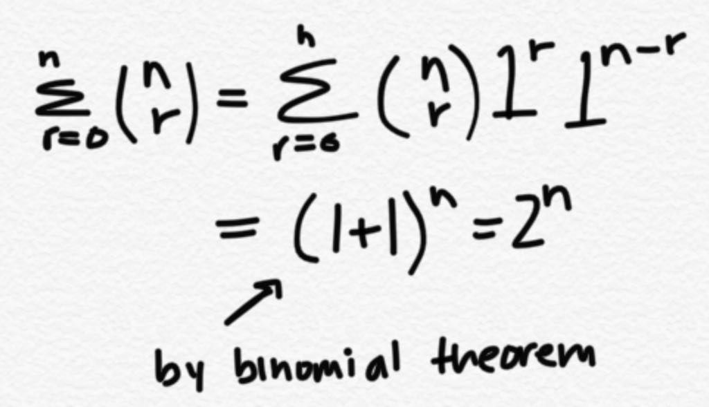

## Day 3 - Sept 9, 2019

### The Axioms of Probability
Given a random experiment with sample space S, we that an event E ⊆ S occurs if, upon the completion of the experiment the outcome is an element of E.

**Probability** is a way of assigning a measure of likelihood of to events.

Given an experiment and an event E belpngs to S, we can say n(E) is the number of times that E occurs after running the exeriment n times.


FOr mathematical reasons, we rather take a more axiomaic approach to probability.

#### Example 1 - Equally Likely Outcomes
Given a sample space with n outcomes, we can say that have "ELO" if each outcome has probability 1/n.
- flipping a coin S = {H,T}, each has probability 1/2
- rolling a die, each outcome has probabiliy 1/6
- drawing an ace in deck of cards -> 4/52 -> 1/13

#### Axioms
Given a sample space S, we define probablity to be roughly a function from the set of events (we wanna assign a probability to an event) to [0,1] (call the function P)

P satisfies the following axioms:
1. P(S) = 1
2. For any event, E ⊆ S,  0 <= P(E) <= 1
3. For any sequence of events E1, E2... such that the events are mutually exclusive,, ie for an i != j, Ei ⋂ Ej = Ø) we have that


```
in particular, for E, F such that E ⋂ F = Ø, P(E U F) = P(E) + P(E)
```

If S is discrete then by axiom 3, for any E subset of S, P(E) = the sum of P({x})

##### Example Rolling a die
```
P({even roll}) = P({2}) + P({4}) + P({6})
               = 1/6 + 1/6 + 1/6 = 3/6 = 1/2
```

Proposition: Given an event E,  P(E<sup>C</sup>) = 1-P(E)

Check: E ⋂ E<sup>C</sup> = Ø and E U E<sup>C</sup> = S

By axioms 1. and 3.

```
1 = P(S) = P(E U E^C)
         = P(E) = P(E^C)
  P(E^C) = 1 - P(E)
```

Statement: In general, given E subset of F, then P(E) <= P(F) due to the following

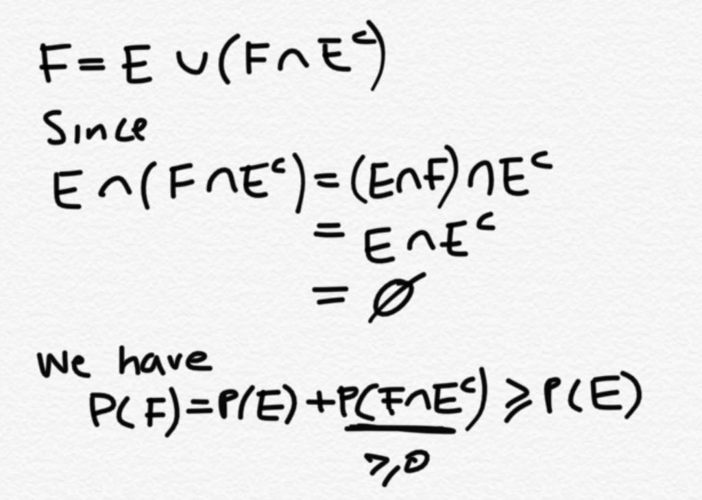

Reminder: E and F are mutually exclusive iff E ⋂ F = Ø 

Recall For mutually exlusive E,F

`P(E U F) = P(E) + P(F)`

Ex rolling a die S= {1..6}

In general, given any 2 events E,F  (mutually exclusive or not), `P(E U F) = P(E) + P(F) - P(E ⋂ F))`

##### Example - Rolling a Die

```
E={1,2,3,4}

F={3,4,5,6}

P(E) = 2/3

P(F) = 2/3

P(E U F) = 1
         =  P({1,2,3,4,5,6})
         = P({1,2,3,4}) + P({3,4,5,6}) - P({3,4})
         = 4/6 + 4/6 - 2/6
```

More general

```
P(A U B U C) = P(A) + P(B) + P(C) - P(A ⋂ B) - P(B ⋂ C) - P(A ⋂ C) + P(A ⋂ B ⋂ C)
```
#### For next time
What is the probability of a royal flush?

```
royal flush = 10,J,Q,K,A
P(royal flush) = 4/((52 5)^T)
               = around 0.00002%
```

## Day 4 - Sept 11, 2019

### Conditional Probability
- suppose you have a well shuffled deck of cards
- probability of drawing an ace is 4/52
- top card is drawn so there are 51 cards
- question: what is the probability the second card is an ace
- if the first card drawn was an ace then the probability of drawing another ace is 3/51
- if the first card was not an ace then the probability of drawing another ace is 4/51
- the idea is that the probability of one event is conditinal upon another event (that we may or may not know)
- Given events A and V, the outcome of event B may influence the probability that event A occurs
- we write P(A|B) to mean the probability of A assuming event B has occured
- Ex if A = 'second card is ace' and B = 'first card is ace then P(A|B) = 3/51
- in general, **`P(A|B) = P(A ⋂ B)/P(B)`**

```
P(A|B) = P(A ⋂ B)
        ---------
          P(B)
```

#### Experiment
- Imagine the experiment is rolling two die consecutively
- the size of sample space is 6*6 = 36
- Question: what is the probability the sum total of the 2 rolls is greater than 7 given that the first roll is a 3?
- step one name your events to isolate them
    - A = "the total is greater than 7"
    - B = "first roll is 3"
- we need to find P(A ⋂ B) and P(B)
- first, P(B) = 1/6
- second, P(A ⋂ B) = ?
- A intersect B = total is greater than 7 and first roll is 3
- outcomes of the form (m,n) then we are looking fir the outcomes of the form (3,n) so the options are where 3 + n > 7, n > 4 (3,5), (3,6)
- therefore P(A intersect B) = 2/36 = 1/18
- so P(A|B) = (1/18)/(1/6) = 6/18 = 1/3

### Intersection/Multiplication and the Laws of Total Probability
Recall that for unions we have an inclusion and exclusion principle
- P(A U B) = P(A) + P(B) - P(A intersect B)
- by rearranging the formula for conditional probability we get the following multiplication rule
    - P(A ⋂ B) = P(B|A)\*P(A) = P(A|B)*P(B)
- we use this when we know the probability of an event relative to other events


The diagram shows that
    P(B) = P(A ⋂ B) + P(A' ⋂ B)

By the multiplcation rule we can write that 

`P(B) = P(B|A)P(A) + P(B|A')P(A')`

This is the Law of Total Probability and it is very useful.

More generally, given a sequence of events E1...En, the sequence is exhaustive if E1 U ... U ,, En = S, meaning it is pairwise mutually exclusive ( Ei intersect Ej = Ø for all i != j)

Then for any B:

P(B) = P(B ⋂ E1) + P(B ⋂ E2) + ... + P(B ⋂ En)
     = P(B|E1)P(E1) + ... + P(B|En)P(En)

#### Example 1 - Law of Total Probability (LoTP): Shuffled deck

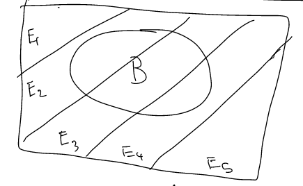

B = "the second card is an ace"

P(B) = ?

Guess: 
    
    E = "the first card is an ace"
    E' = "the first is not an ace"

By L.o.T.P

    P(B) = P(B|E)P(E) + P(B|E')P(E')
         = (3/51)(4/52) + (4/51)(48/52)
         = 4/52
         = 1/13 

#### Example 2 on LoTP
Three identical bags, each containing 10 marbles. 

    Bag 1: 2 red, 4 green, 4 blue
    Bag 2: 4 red, 5 green, 1 blue
    Bag 3: 1 red, 2 green, 7 blue

Assuming the bags are chosen randomly, what is the probability of selecting a red marble?

    R = "choose a red marble"
    Bi = "choose from the ith bag"
    P(Bi) = 1/3

By law of total probability we have 

    P(R) = P(R|B1)P(B1) + P(R|B2)P(B2) + P(R|B3)P(B3)
         = (2/10)(1/3) + (4/10)(1/3) + (1/10)(1/3)
         = (2/30) + (4/30) + (1/30)
         = 7/30


## Day 5 - Sept 12, 2019

### Independence
- In some situations the occurence of one event has no effect on the progrability that some other event occurs

#### Example - Independence
Consider a bin of 50 car parts. Suppose 3 are defective, 47 are not. Experiment is to choose 6 parts randomly, but replace each part after each choice.

Question: What is the proability that the second part you pick up is defective given that the first part is also defective.

A<sub>i</sub> = "the ith chosen part is defective"

We want to find P(A<sub>2</sub>|A<sub>1</sub>) 

P(A<sub>i</sub>) = 3/50

P(A<sub>2</sub>|A<sub>1</sub>) = 3/50

In this situation, the outcome of the first event did not do anything to the second event

P(A<sub>2</sub> ⋂ A<sub>1</sub>) = (3/50)(3/50)

#### Definition - Independence
Given 2 events, we say that A1 and A2 are indepdendent if any of the following equivalent conditions are met
1. P(A1|A2) = P(A1)
2. P(A2|A1) = P(A2)
3. P(A1 ⋂ A2) = P(A1)P(A2)
4. P(A1' ⋂ A2') = P(A1')P(A2')

**Warning**: IF A1 A2 are mutually disjoint, P(A1 U A2) = P(A1) + P(A2)

If A1 A2 are indepedent, P(A1 ⋂ A2) = P(A1)P(A2)

You can't have mutually disjoint and independent events bc of the following,

Suppose that A1 and A2 are mutually exclusive, annd that P(Ai) != 0

Then we have that 0 = P(Ø) = P(A1 ⋂ A2) != P(A1)P(A2) != 0

If you have mutually exclusive events then they are automatically not independent.

In general, events E1.. En are independent if P(E1 ⋂ ... ⋂ En) = P(E1)..P(En)

#### Example 2 - Independence

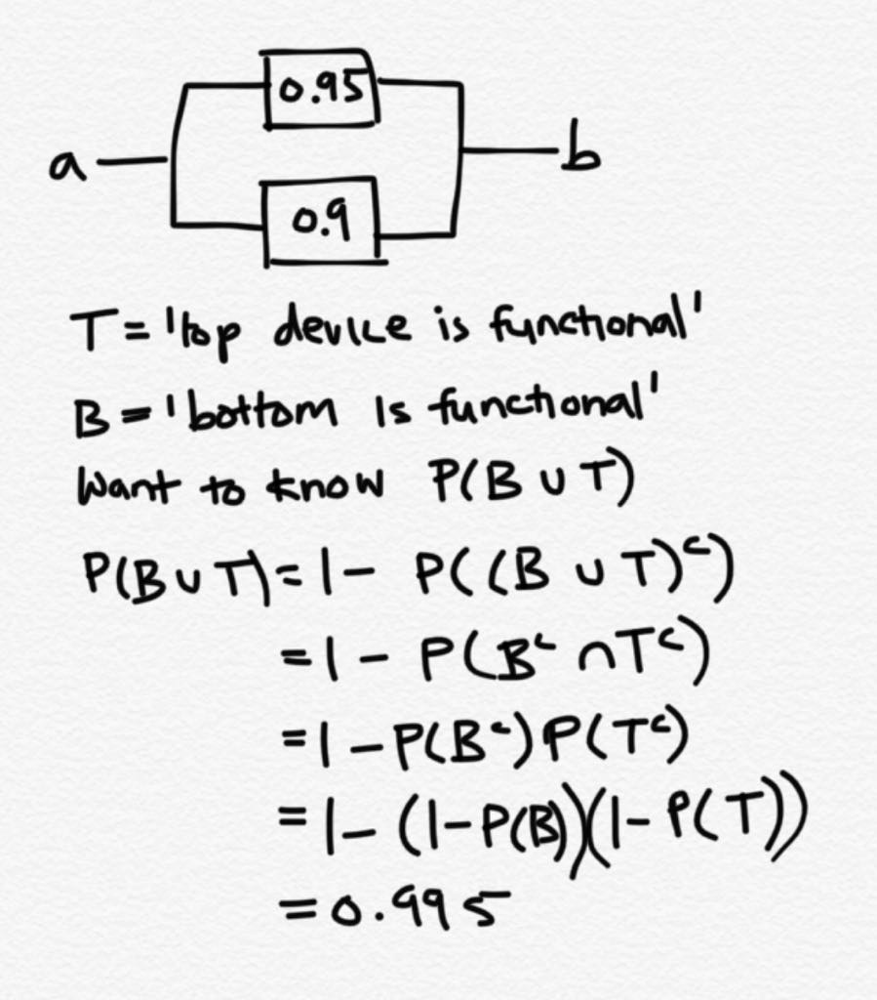

#### Example 3 - Independence

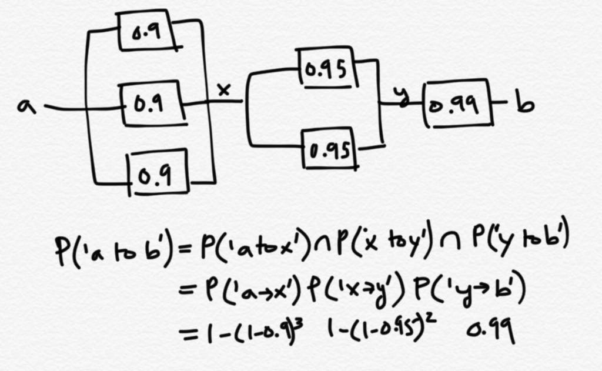

### Random Variables
Definition: Given a sample space of a random experiment, a random variable is a function that assigns a real value to each outcome (always denoted by capital letters).

Random variables can be discrete or continuous. 
- discrete: range is finite or countably infinite
- continuous: range contains a real interval

#### Example - Discrete Random Variables
- \# of heads in 1000 coin tosses
- \# of defecive parts/10000 on a production line
- \# errors perbinary string of given length

#### Example - Continuous Random Variables
- current
- temperature
- pressure

## Day 6 - Sept 16, 2019

### Discrete Random Variable
Recall: Given a sample space S for som random experiment, a discrete random variable (DRV), X, is a function that assigns real vlaues to the elements of S, such that the range of X is either finite or countably infinite.

Definition: A probability distribution for a random variabe, X, is a description of the probabilities associated to the possible values of X.

For DRV, this is often presented as just a list of possible probabilities. (more complicated is denoted by a formula)

#### DRV Example
Consider the experiemtn given by tossing a coin 3 times (sample space is 8). H= "# of heads", H is a DRV with range given by {0,1,2,3}. The probability distribution is:

```
P(H=0) = P({(t,t,t)}) = 1/8
P(H=1) = P({t,t,h), (t,h,t), (h,t,t)}) = 3/8
P(H=2) = P({(t,h,h), (h,t,h), (h,h,t)}) = 3/8
P(H=3) = P({(h,h,h)}) = 1/8
```

### Probability Mass Function
Sometimes a probability distribution is presented in terms of a function called "probability mass function":

Defn: Given a discrete random variable, X, with range {x1, x2...}, then a probability mass function f(x) is one satisfying:
1. f(x<sub>i</sub>) >= 0 forall i)]
2. the sum of all possible outcomes of f(x<sub>i</sub> = 1
3. f((x<sub>i</sub>) = P(X=(x<sub>i</sub>)

#### Probability Mass Function Example
In the previous experiment, we can say f(x) = (3Cx)/8

### Cumulative Distribution Function (cmf)
Another way to describe probability distribution is cumulative distributive functions.

For a ranom variable X, the cumulative distribution function is

```
F(x) = P(X <= x) 
     = sum of all events xi <=x of f(xi)
```

#### CMF Properties
1. 0 <= F(x) <= 1
2. x <= y =: F(x) <= F(y)

#### N.B
Given F(x) for some discrete random variable X, we can recover the probability mass function

```
f(xn) = F(xn) - F(x(n-1))
      =(f(x1) + ... + f(x(n-1)))
      = f(xn)

```

#### CMF Example
X DRV with range {1,2,3...}

```
f(x) = P(X=n) = 1/(2^n)

Then F(n) =sum of ....
```

Note: limit of n-> inf F(n) = 1

### Mean and Variance of a DRV
- Two numbers: summarize lots of info about a probability distribution.

Let's let X be DRV with probability mass function f(x)

#### Mean aka Expected Value

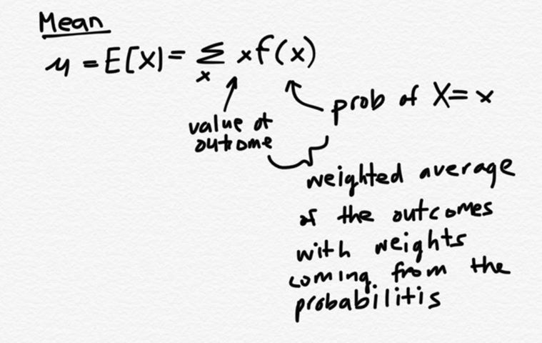

#### Variance

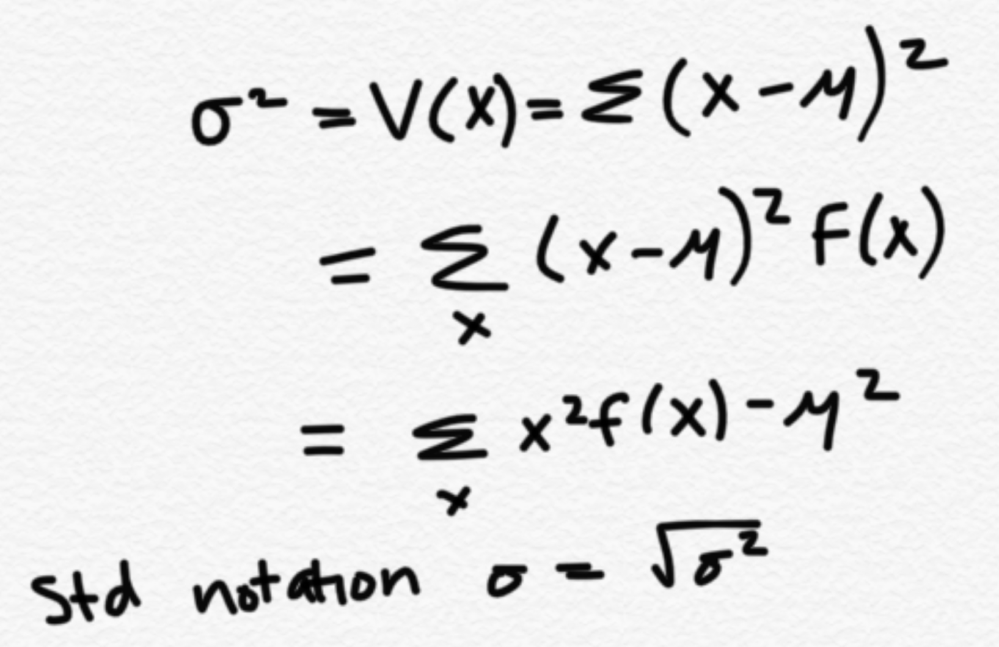

#### Example
Consider the following game.
- a fair die is rolled
- if the roll is n = 2,3,5 you win $2n
- if the roll is n=1,4,6 you get nothing

Quetion: How much would you pay to play this game?

Reasoning: Don't want to pay more than the expected value of a single game. The expected value is the average outcome of an experiment

```
Set W = "winnings" in dollars
range(W) = {0,4,6,10}

E(W) = ?

P(W=0) = 3/6 = 1/2
P(W=4) = 1/6
P(W=6) = 1/6
P(W=10) = 1/6

E(W) = 0*(3/6) + 4(1/6) + 6(1/6) +10(1/6)
     = 20/6
     = $3.33
```

## Day 7 - Sept 18, 2019

**Remark** on Functions of Discrete Random Variables, given DRV X h: R->R, h(X) := DRV

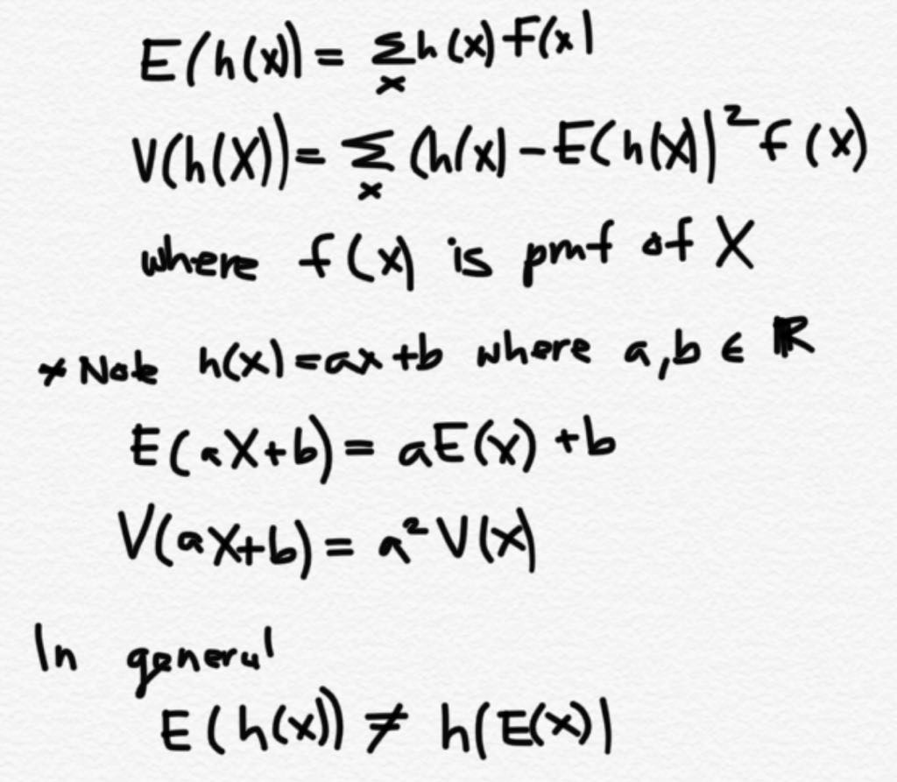

### Binomial Distribution
- suppose we have n trials i.esame experiemnt repeated n times
- for each trial we assume 2 possible outcomes
    - heads-tials, pass-fail
    - assume that outcomes are mutually exclusive
        - can't get heads tails at the same time
    - outcomes are 'success/failure'
    - assume the tials are independent and that each trial has probability 0 < p < 1 of being successful
        - it follows that each trial fails with probability 1-p
    - these trials are called Bernoulli trials
    - n bernoulli trials, each with fixed probability `p`
- we say that Bin(P,n) (we will call this X for simplicity) is calledd binomial with parameters n = 1,2,3... an 0 < p < 1 if:

X = "the number of successful trial in n many Bernoulli trials with probability p

- the probability mass function of X is f(m) = (n choose m)P<sup>m</sup>(1-p)<sup>n-m</sup>
- interpretation, given n Bernoulli trials, f(m) is the probability that you are successful m times

#### Example - Flipping a Coin 10 Times
- our parameters would be n=10 and p=0.5
- if we flip it 3 times, f(m) = (3 choose m)(.5)<sup>m</sup>(0.5)<sup>3-m</sup> = (3 choose m)(0.5)<sup>3</sup>

#### Computing Mean of Binomial Random Variable
- mean of X = Bin(p,n)
- recall that to compute the mean of a random variable is

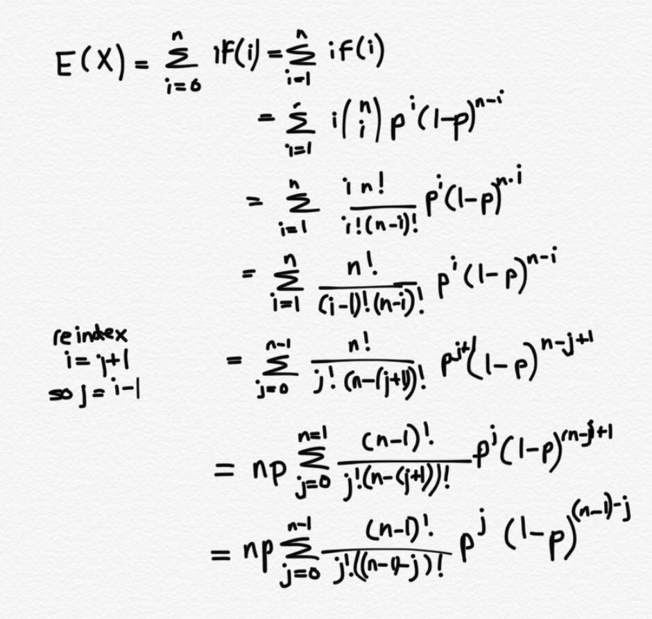

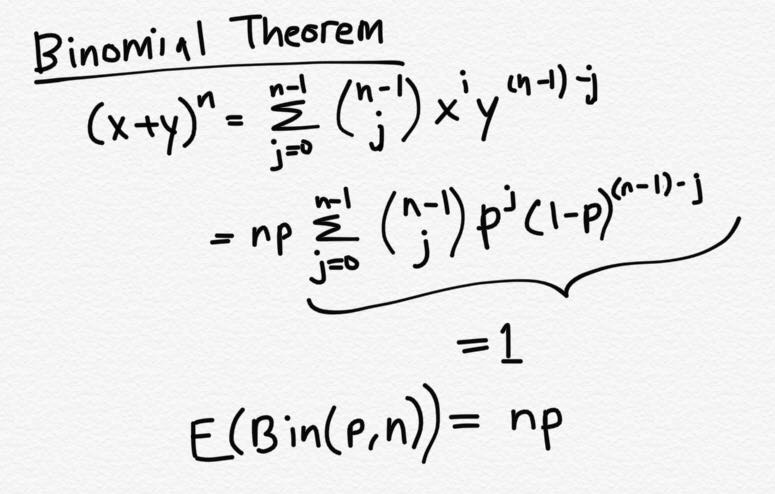

#### Example - Bernoulli Trials
- Midterm - Sept 30
- 27 multiple choice
- each wth 4 possibilities
- independent questions

Question: What is the probability of passing if you guess every question?

Each question is a Bernoulli trial with 1/4 being probability of success.

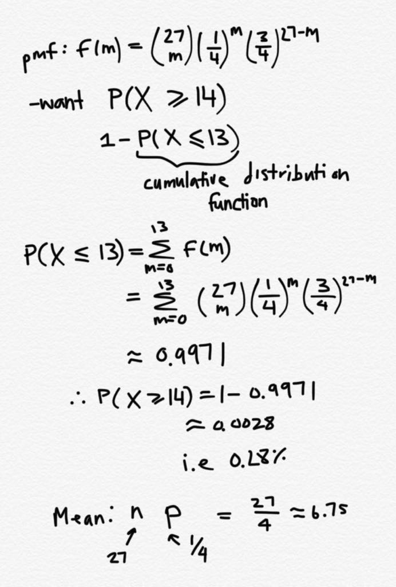

## Day 8 - Sept 19, 2019

### Geometric and Negative Binomial Distribution
Recap: A Bernoulli trial s an experiment/series of experiments where the trials are
- independent
- have 2 possible mutually exclusive outcomes i.e success/fail
- each trial has fixed probability p of success

Bin(p,n) = # of successes in n-many trials


- geometric distribution is related
- rather than some fixed n number of trials, we allow arbitrarily many
- say that DRV X is geometric with parameter 0 < p < 1
- X = # of trials untli first success
- if X is geometric with parameter p, then X has a probability mass function:
    
f(x) = (1-0)<sup>x-1</sub>p

Interpretation: f(x) = probability of failing x-1 times and then succeeding on the x-th try

#### Mean

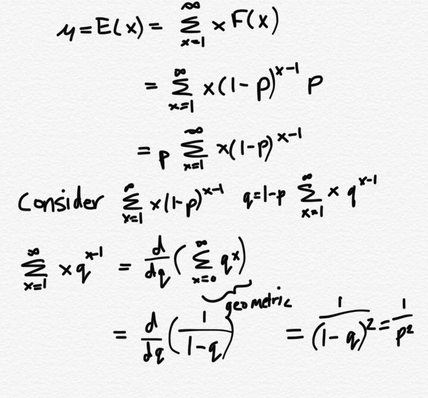

By the following:

     μ = E(x) 
       = p(1/p^2) 
       = 1/p

#### Geometric Distribution Example
- the probability of a bit transmitted through a digital channel is received on error is 0.1
- assume the transmissions are independent
- say X = "the number of bits transmitted until the first error"
-       probability of success = 1 - q = 1 - 0.1 = 0.9
- what is the probability that at least 10 bits are transmitted without error?
- i.e P(X>=10) = 1 - P(X<=9)

```
P(X>=10) = 1 - P(X<=9)
         = 1 - sum from 1 to 9 of (0.9)^(x-1)*(0.1)
         = close to 1

```
### Negative Binomial Distribution
Recall: X is geometric if X = "the number of Bernoulli trials until a success"

- negative binomial distribution isa generalization of this
- fix a positive integer r >= 1
- say a DRV X is negaive binomial with parameters p, r if X = "number of trials until r successes"
- Note if r = 1 this is exactly geometric
- if X is negative binomial with r and p, we have a probability mass function:

```
f(x) = x-1 C r-1 (1 - p)<^(x-r)(p^r)
    x = r, r+1, r+2....
```

Suppose X is a negative binomial RV with params r, p, we can write X = X1 + ... + Xr where Xi = "number of trials until the i-th success"
- each i is a geometric RV
- this implies (w/o justification for now) that the mean of x E(X) = r*E(x) = r/p and the variance V(X) = r(1-p)p^2

#### Example - Inverse Binomial Sampling
Suppose you, a redhead, want to form a club of red-haired people and suppose you want no more than 10 people. Suppose you call people at random and ask them the colour of their hair.

Q: Supposing that no more than 2% of the population has red hair, what is the probability of calling 10 redheads if 
    1. you make 50 calls?
    2. 500 calls?
    3. 1000?
    4. infinity?

```
PMF: f(x) = (x-1) choose (10-2) * (1- 0.002)^(x-10) * (0.02)^10

f(50) = 9.37 * 10^-9 9.37 * 10^-8 %

f(500) = 0.0025, 0.25%

f(1000) = 0.00005
```

You're looking to call 10 people so you
