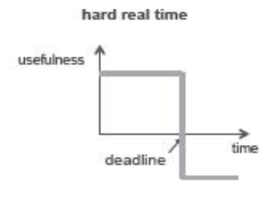

# 4AA4 Real Time Systems

## Day 1 - Sept 3, 2019

### Prof Details
- Wenbo He
- Office: ITB124,12:30-1:30 on Tuesdays and Thursdays
- email: hew11@mcmaster.ca

### Grading
- midterm 1 -15% - sept 26
- midterm 2 - 15 - oct 24
- midterm 3 - 15 nov 21
- labs - 20% - 
- final - 35%
- bonus marks for quizzes + participation

### General Systems
- set of interacting or independent component parts forming a complex whole
- takes input followed by black box and gives output
- there's a delay for the reponse and this is an important characteristic of the given system
- there are first order and second order systems, which charaterize how the step response would look wtr time

### Computing Systems
- besides the performance (aaccuracy, functionality, robustness, usability) the response speed (delay) is also important
- computing systems can be defined as systems where the response time or speed matters

### Formal Definition
- as a computer system in which the correctness of the system behaviour depends not only on logical results but also the physical instant at which these results are produced

### Real Time Systems
- response time
- time interval between a stimulus (inupt) and corrsponcing respone (output)

- a real time system is where a timely response to external stimuli is vital
- does not meean faster is better but that it must satisfy explivit response time contrainct otheriwse failure may occur :( 

### Different Kinds of Real Time Systems
1. Soft RTS 
    - where performance is degraded but not destroyed by failure to meet response time constraints
    - for example network sytems/ network applications
    - TCP/IP protocols - the time constaints of packet being delivered to reciever, if it is not deliered on time then the receiver has to request for packet again from sender
    - it's tolerable
    - more examples
        - streaming videos
        - computer games
        - online chatting

2. firm RTS
    - missing a few deadlines will not lead to total failure but missing more than a few may lead to complete catasrophic system failure
    - more examples
        - manufacturing systems with robot assembly lines
        - coursework submission

3. Hard RTS
    - missing even a dingle deadline will caus a complete catastrophic system failure
    - more examples
        - mission critical systems
        - nuclear systems
        - mdeical applications such as pacemakers

### Comments about RTS
- mutitasks
    - periodic tasks
    - aperiodic tasks
- schedulability
    - the ability of tasks to meet all deadlines
- performance
    - what happens if the system cannot schedule, if the system cannot meet the tasks to meet deadlines what should be done

### Questions
1. what should we do if not all deadlines are met
2. does a real time system mean a "fast system"?

### Quiz 1
- what are the major differences between a thread an a process
- given an open loop transer G(s), what is the closed loop transfer function (with unit feedback)
- what do you expect to leanr in this course
