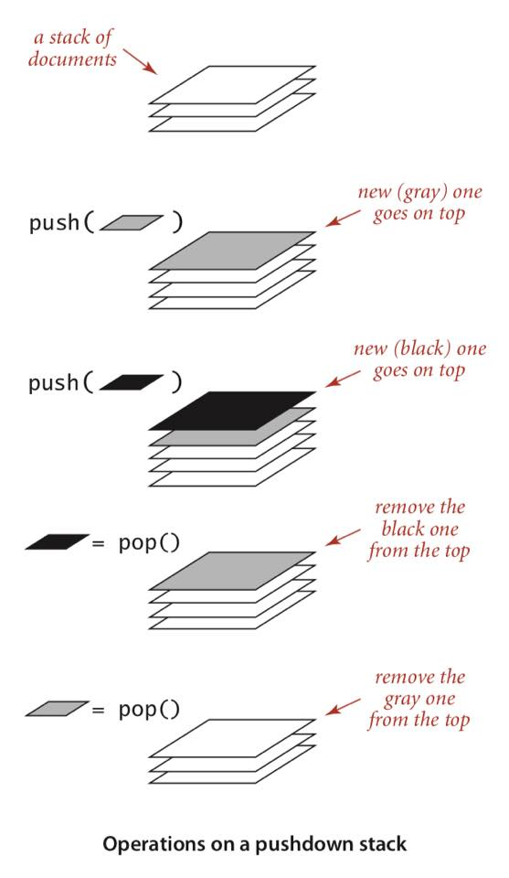

# Algorithms and Data Structures

## Fundamentals

### Bags, Queues, and Stacks
- abstract data types that are used as collections

#### APIs

**Bag**

```
public class Bag<Item> implements Iterable<Item>
        Bag()               // create an empty bag
   void add(Item item)      // add an item
boolean isEmpty()           // is the bag empty?
    int size()              // number of items in the bag
```

**FIFO queue**

```
public class Queue<Item> implemens Iterable<Item>
        Queue()             // create an empty queue
   void enqueue(Item item)  // add an item
   Item dequeue()           // remove the least recently added item
boolean isEmpty()           // is the bag empty?
    int size()              // number of items in the bag
```

**Pushdown LIFO stack**

```
public class Stack<Item> implemens Iterable<Item>
        Queue()             // create an empty queue
   void enqueue(Item item)  // add an item
   Item dequeue()           // remove the least recently added item
boolean isEmpty()           // is the bag empty?
    int size()  
```

##### Generics
- collection ADTs can be used for any data type
- `<Item>` is a type parameter, a placeholder for a reference to a data type such as String, Date, or Integer

##### Autoboxing and Unboxing
- Java has special mechanisms to allow generic code to be used with primitive types
- Java wrapper types are reference types that correspond to primitive types (Boolean vs boolean)
- Java automatically converts between reference types and their correponding primitive types
- **autoboxing** - automatically casting primitive type to wrapper type
- **unboxing** - automatically casting wrapper type to primitive type

```
Stack<Integer> stack = new Stack<Integer>();
stack.push(17) // autoboxing int to Integer
int i = stack.pop(); // unboxing Integer to int
```

##### Iterable Collections
- clients requirements involving processing items or iterating thought them
- therefore, we need clear and compact code that is not dependent on the collection's implementation
- the **foreach** statement below does not know anything about the collection's implementation 

```
for(Transaction t : collection)
{   StdOut.println(t)   }
```

##### Bags
- a bag is a collection where removing items is not supported
- its purpose is to allow clients to collect item and iterate through them
- the order of iteration is unspecified
- think of a marble collector that puts marbles in a bag in no particular order but might want to process them by colour


##### FIFO queues
- a FIFO queue is a collection based on the first-in-first-out policy
- doing tasks in the same order that the arrive, thereby allowing us to preserve relative order


##### Pushdown stacks
- a stack is a collection based on the last-in-first-out policy
- think of a stack of plates, the most recently placed plate will be the first one to be used



##### Arithmetic expression evaluation
- 